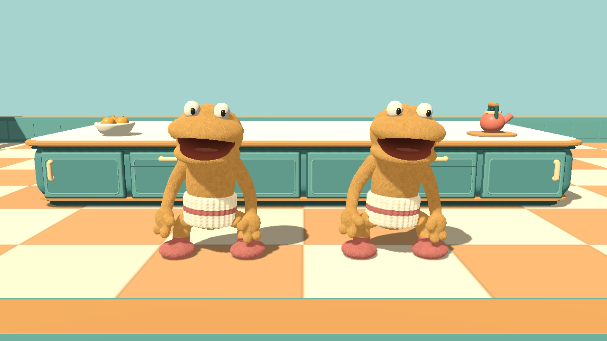

# Owner-matching Decoy Double — v0.57

Native Godot capture: original player on the left, deployed copy on the right. The owner is made visible only in this staged comparison; during normal play the owner remains invisible and leaves footsteps. UI, scores and loose obstacles are hidden for inspection, with normal game lighting and no paint-over.

The deployed decoy uses the same Sockling sculpt, fleece color, cuff, feet and arm rig as its owner. Materials, skeleton and animation state are independent, so owner hiding and effects cannot hide the decoy. The decoy faces its movement direction and animates from observed travel on both host and clients. The pickup icon and four-second ability mechanics are unchanged.

Reproduce with graphical Godot: `--path . --script res://tests/decoy_skin.gd -- --ati-test-instance --decoy-preview`. Output is `build/network-test/decoy-skin.png`.

Tests: `decoy_skin.gd` covers all four owner colors, model scale, shared geometry/independent materials and joints, facing, hidden owners, client reconstruction, running/stopping and expiry. `decoy_skin_network.gd` runs separate host/client processes to check both players' copies and replicated removal through the existing authoritative snapshots. Local tests do not establish Internet/tunnel reliability or low-end hardware performance.
