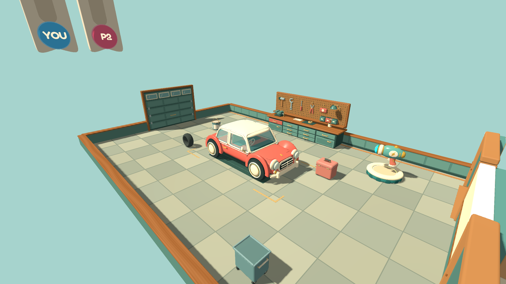
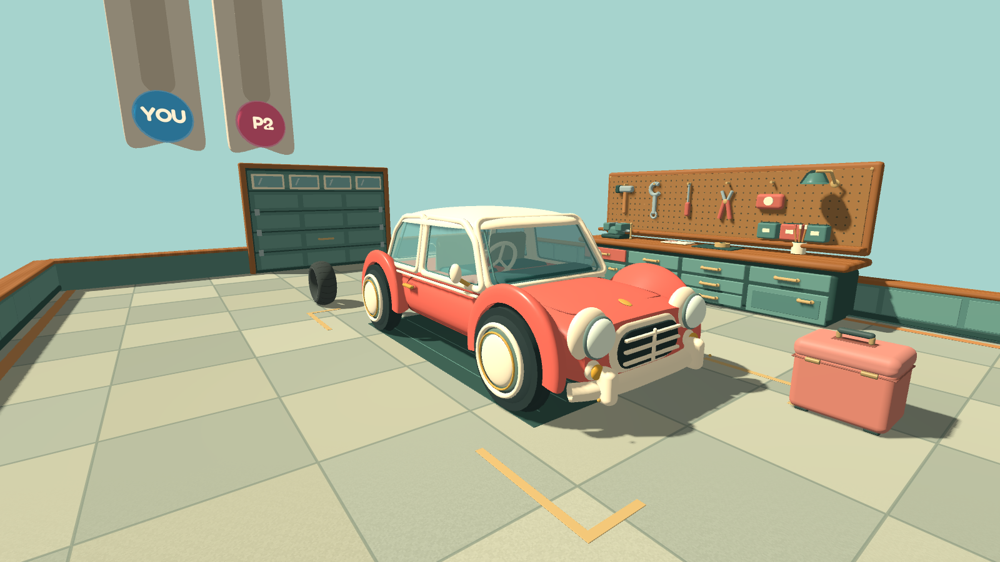
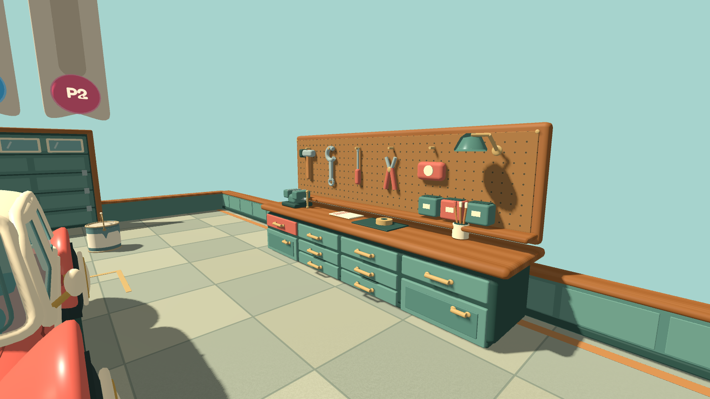
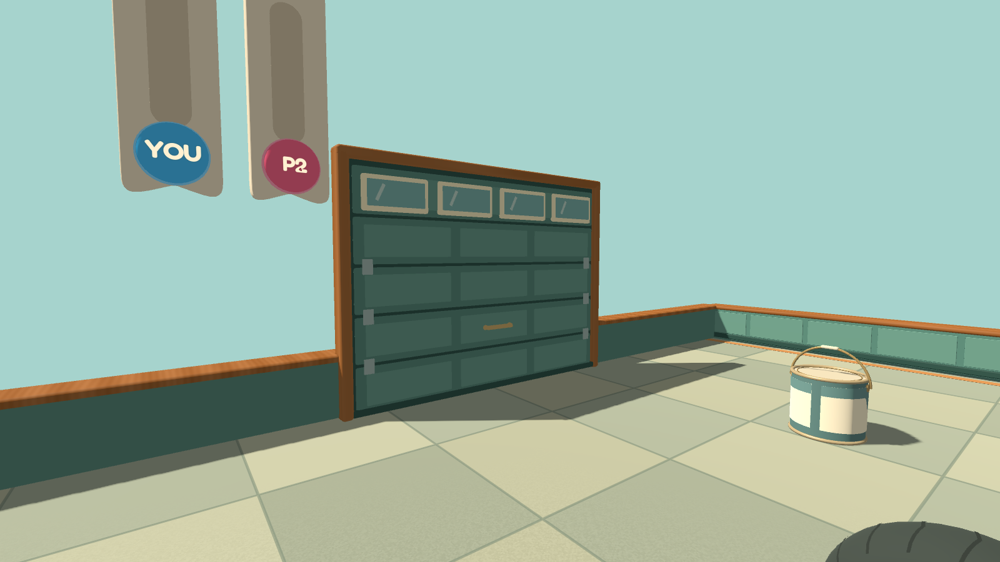
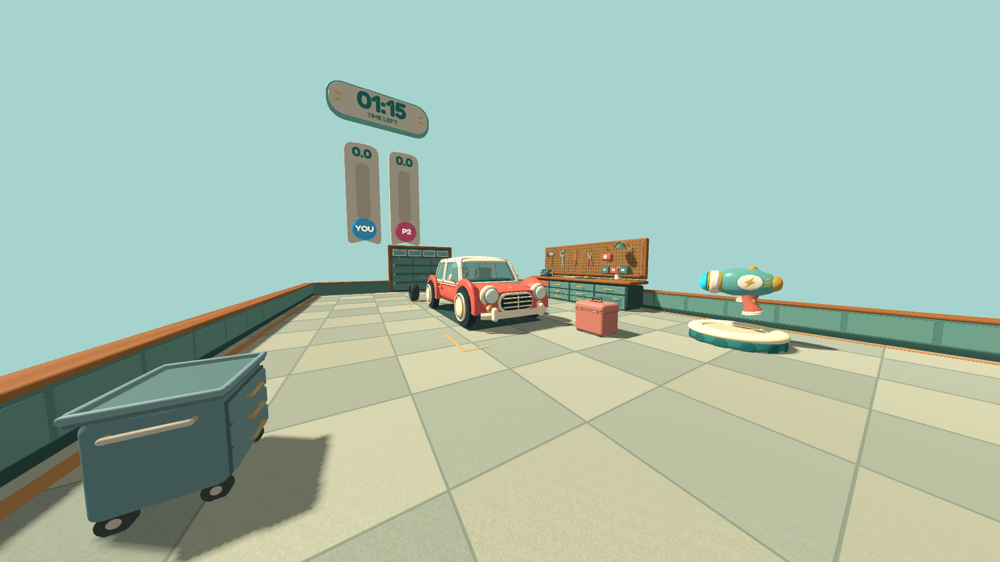
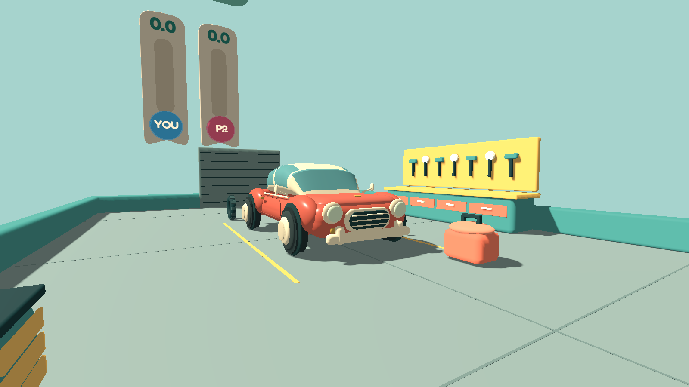
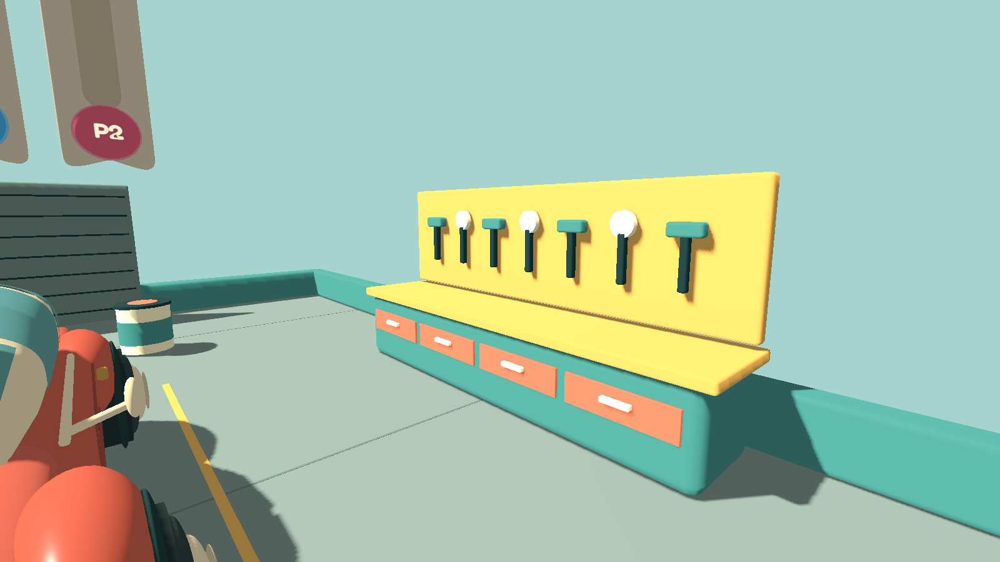

# Garage refresh — v0.62

This is an implemented art pass, not a generated replacement mockup. Captures use the actual main scene, Godot Compatibility renderer, production lighting and game assets. The HUD and players are hidden for inspection. The `garage-first-person.png` view uses the game's 100° field of view; the other views use a 64° presentation camera. Gameplay uses the same meshes and materials.

## Reference and intent

The approved [prop reference](../prop-refresh/approved-concept.png) supplies the rounded coral compact, cream roof, bulbous wings, circular lamps, inset glass and warm toy-like materials. The approved [kitchen reference](../kitchen-refresh/approved-concept.png) supplies the sage cabinetry, wood trim, brass hardware, cream accents and restrained domestic clutter. The workshop extends that established language; there is no separate saved garage-wide concept that these new workshop details reproduce exactly.

- Rebuilt the car with a domed cream roof, softer window outlines, separate pillars, upholstered seats, steering wheel, sculpted wings, wheel-rim layers, curved bumpers, and body-following seams. Multiple renders exposed and corrected mesh winding and trim artifacts.
- Replaced the plain bench with inset cabinets/drawers, brass pulls, wood grain, a vise, brush pot, repair mat, tape and folded striped cloth.
- Added a perforated pegboard with distinct tools, parts bins and a rounded enamel task lamp.
- Replaced the plain shutter with framed sections, inset windows, wood jambs, hinges, lift handle and rubber sweep.
- Rebuilt the tire, toolbox, paint can and rolling cart, including tread, hinges/latches, wire bail, painted drips, drawer hardware and casters.
- Added subtle floor aggregate, larger muted service-floor tiles, short parking-corner markings, a flush repair mat, matching wall insets/wood caps and bounded bounce lighting. Enabled 2× MSAA to soften edges.

## Actual game captures

### Before this pass

## Gameplay boundaries

This remains the same open-topped, low-walled chase module. The cinematic reference's full-height walls and room enclosure were not added: that would change sightlines, jumps and escape routes. The car's roof reaches 2.0 m, close to its previous visual roof height; its original simple collider is unchanged. Small decorative handles and molding are visual-only, as in the existing kitchen.

All thirteen garage static bodies and seventeen collision shapes, four movable garage objects, pickup locations, doorway clearances, bot routes and snapshot IDs are preserved. Physics, movement, scoring, network protocol and connection settings are untouched. No new pushable objects or text signs were introduced.

## Construction and verification

`garage_art.gd` owns stationary dressing; `garage_prop_art.gd` owns movable visuals. Both use deterministic procedural meshes with cached primitives/materials. Workshop details are merged by material and shadow setting, with named anchors retained for inspection. Object-space wood/pegboard materials remain separate to preserve their texture coordinates. Trim is deliberately simpler than hero silhouettes, and small hardware has restricted shadow casting.

`tests/garage_visual_integration.gd` checks the exact collision/ID/layout contracts, deterministic independent loads and editor rebuilds, mirrored and rotated room instances, visual landmarks, movable prop envelopes, snapshot mapping and round reset. Existing house tests exercise door clearance, navigation and the full twelve-object registry. The capture helper is `tests/garage_art_preview.gd`; it can also run against the exported player pack with `--garage-output=` pointing to a writable capture directory.

The final garage contains 223 drawable mesh instances and 240,060 triangles before rendering passes, below its fixed regression guardrails. Combining the movable hardware reduced its mesh count from 71 to 36. A separate batching regression verifies nonuniform-scale normal transforms, mirrored winding, vertex channels and material/shadow preservation; glass and coordinate-sensitive shaders are kept separate. These are geometry measurements, not frame-rate claims.

Final verification on September 22, 2026: **65/65 automated test processes passed** (source suite, including paired localhost multiplayer tests). Six views were also rendered from the exported v0.62 player resource pack in an isolated directory, with test/reference-file exclusions checked; the standalone Windows executable passed a separate startup check with exit code 0 and no errors. The after images above come from that exported pack. Ignored local verification logs are in `build/test-results/20260922-191304-005-32672/` and `build/garage-pack.*.log`.

Local screenshots establish the appearance on the tested Windows/OpenGL renderer, not a minimum-spec or Internet performance guarantee. GitHub publishing remains paused; v0.62 is packaged locally.
