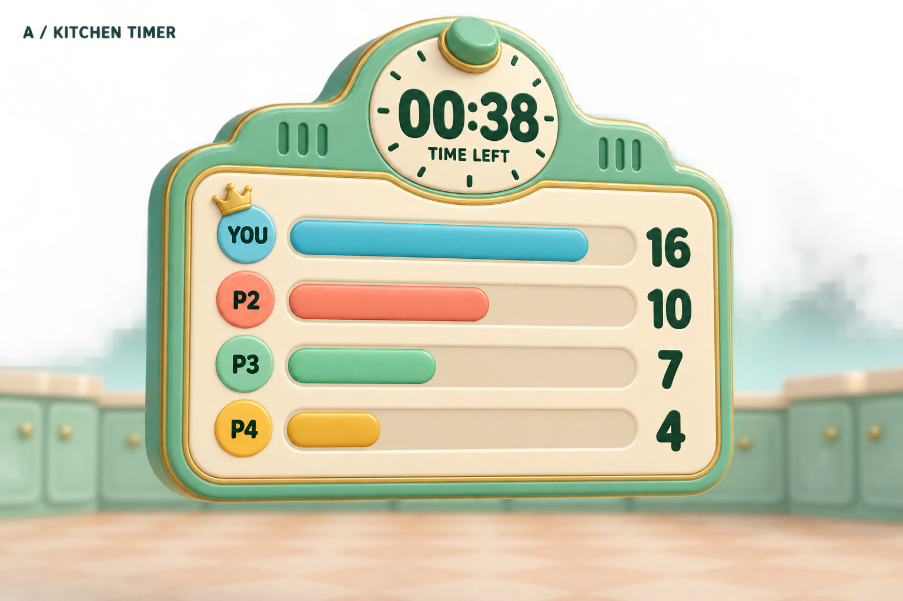
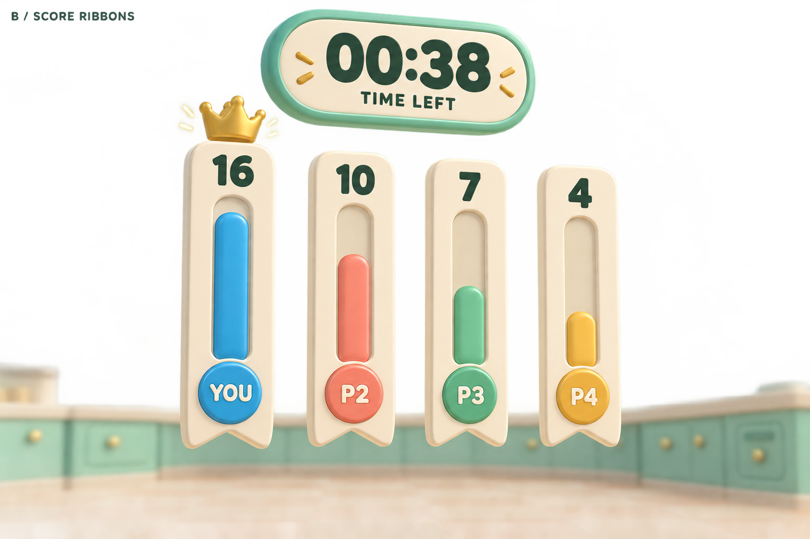
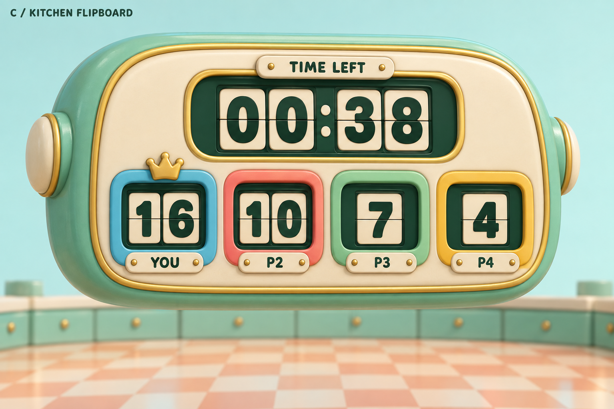

# Floating leaderboard concepts — 2026-09-21

Status: B — Score Ribbons selected by the user and implemented in v0.54. A and C remain unused concept alternatives.
Generation mode: built-in image_gen, one generation call per concept.

All three retain a large remaining-time display, four color-coded player scores and a leader crown. Sample state: 38 seconds remaining, 37 accumulated scoring seconds shared across four players.

- A — Kitchen Timer: horizontal score bars in a retro kitchen-timer frame.
- B — Score Ribbons: separate floating vertical score pennants; the lightest silhouette.
- C — Kitchen Flipboard: bold mechanical number tiles in a rounded appliance casing.

The generated previews are design references, not Godot screenshots. [Actual v0.54 Godot captures](../v054/README.md) preserve the real game lighting and show the chosen design at inspection and player distances.

## A — Kitchen Timer



### Final generation prompt

```text
Use case: stylized-concept.
Asset type: 3D world-space multiplayer leaderboard concept for the cartoon game Around the Island, NOT a flat app interface.
Art direction: charming Saturday-morning-cartoon household world, soft chunky rounded geometry, mint/teal enamel, warm cream ceramic, honey-gold trims, restrained coral accents, soft shadows and readable bold rounded typography. Feels like a lovingly designed physical toy. Favor shapes that could actually be modeled for a small Godot game. No elaborate micro-detail.
Scene/backdrop: the scoreboard is levitating unsupported in open pale-aqua space beyond the low perimeter of a toy kitchen arena. A little out-of-focus apricot-and-cream checkerboard floor and mint cabinetry along the bottom establishes scale; no sky islands, buildings, extra props, characters, hands, or weapons. The scoreboard is the dominant subject, all parts fully in frame.
Composition: landscape 3:2 polished game-prop concept render, near frontal at a slight three-quarter angle so its physical depth is evident, clear negative space around the object. Large enough to read at a glance. Soft warm neutral lighting, restrained reflections, no blinding bloom. No watermark or brand logo.
Data invariants: exactly four players, in this order: cyan-blue YOU with score 16, coral P2 with score 10, mint-green P3 with score 7, golden-yellow P4 with score 4. Scores are accumulated seconds holding a spark. Single timer reads exactly "00:38" with small label "TIME LEFT". A small chunky gold crown marks YOU as the current leader, never obscure numbers. No extra players, no repeated panels, no additional timers. All numbers and labels use dark evergreen on cream or cream on deep evergreen for excellent contrast. This is a design proposal, not an actual screenshot.
Primary request: concept A, KITCHEN TIMER. Design a floating retro kitchen-timer scoreboard with a warm friendly appliance personality.
Subject: a single rounded rectangular creamy enamel board, mint edge and modest honey-gold bevel. A large round mint kitchen timer is integrated into the top silhouette like a rounded crest, with a cream face, short tick marks, a tiny chunky knob, and huge dark numerals "00:38" with "TIME LEFT" below. Do not add clock hands that obscure the digital countdown.
Under the timer, four clearly separated horizontal race lanes sit on the cream panel. At the left of each lane a round colored player badge with its label "YOU", "P2", "P3", "P4"; a soft capsule score bar; at the right a large score number "16", "10", "7", "4". Bars are in 16:10:7:4 proportion, with identical faint cream tracks behind them. A small gold crown perches beside the blue YOU badge only. Four rows only, strong spacing, no buttons.
Character: the most practical and legible of the concepts; a clean racing scoreboard with the nostalgic charm of an egg timer. Not an ornate trophy, not a shelf.
Only presentation title outside the object in upper-left negative space, small clean type: "A / KITCHEN TIMER".
```

## B — Score Ribbons



### Final generation prompt

```text
Use case: stylized-concept.
Asset type: 3D world-space multiplayer leaderboard concept for the cartoon game Around the Island, NOT a flat app interface.
Art direction: charming Saturday-morning-cartoon household world, soft chunky rounded geometry, mint/teal enamel, warm cream ceramic, honey-gold trims, restrained coral accents, soft shadows and readable bold rounded typography. Feels like a lovingly designed physical toy. Favor shapes that could actually be modeled for a small Godot game. No elaborate micro-detail.
Scene/backdrop: the scoreboard is levitating unsupported in open pale-aqua space beyond the low perimeter of a toy kitchen arena. A little out-of-focus apricot-and-cream checkerboard floor and mint cabinetry along the bottom establishes scale; no sky islands, buildings, extra props, characters, hands, or weapons. The scoreboard is the dominant subject, all parts fully in frame.
Composition: landscape 3:2 polished game-prop concept render, near frontal at a slight three-quarter angle so its physical depth is evident, clear negative space around the object. Large enough to read at a glance. Soft warm neutral lighting, restrained reflections, no blinding bloom. No watermark or brand logo.
Data invariants: exactly four players, in this order: cyan-blue YOU with score 16, coral P2 with score 10, mint-green P3 with score 7, golden-yellow P4 with score 4. Scores are accumulated seconds holding a spark. Single timer reads exactly "00:38" with small label "TIME LEFT". A small chunky gold crown marks YOU as the current leader, never obscure numbers. No extra players, no repeated panels, no additional timers. All numbers and labels use dark evergreen on cream or cream on deep evergreen for excellent contrast. This is a design proposal, not an actual screenshot.
Primary request: concept B, SCORE RIBBONS. Design an airy floating sculptural leaderboard made of four separate long rounded pennants, not a large backplate or shelf.
Subject: Four broad cream enamel ribbon-shaped vertical panels hang magically in open space side by side, equal total height, generous gaps. Each has a round colored badge at its foot labeled respectively "YOU", "P2", "P3", "P4". Each panel has a softly recessed vertical groove with a thick saturated player-colored capsule rising from the bottom in proportion to its score (16:10:7:4); big dark numbers 16, 10, 7, 4 sit in fixed cream top tabs above their respective grooves so numbers align and never overlap the bars. The panels end in very shallow rounded V-cut pennant tips, like toy award ribbons. A modest gold crown floats above the blue player's panel, below and clear of the timer.
Above the four ribbons, one wide floating cream countdown pill with a mint rim reads "00:38" in very large evergreen numbers and "TIME LEFT" below. There is visible negative space between the countdown pill and the four score ribbons. No ropes, no chains, no columns supporting it, no continuous shelf. Tiny restrained warm sparkle accent only around the leader crown.
Character: light, minimal, expressive toy-sport scoreboard; airy silhouette, readable bar comparison, less visual mass than a rectangular sign.
Only presentation title outside the object in upper-left negative space, small clean type: "B / SCORE RIBBONS".
```

## C — Kitchen Flipboard



### Final generation prompt

```text
Use case: stylized-concept.
Asset type: 3D world-space multiplayer leaderboard concept for the cartoon game Around the Island, NOT a flat app interface.
Art direction: charming Saturday-morning-cartoon household world, soft chunky rounded geometry, mint/teal enamel, warm cream ceramic, honey-gold trims, restrained coral accents, soft shadows and readable bold rounded typography. Feels like a lovingly designed physical toy. Favor shapes that could actually be modeled for a small Godot game. No elaborate micro-detail.
Scene/backdrop: the scoreboard is levitating unsupported in open pale-aqua space beyond the low perimeter of a toy kitchen arena. A little out-of-focus apricot-and-cream checkerboard floor and mint cabinetry along the bottom establishes scale; no sky islands, buildings, extra props, characters, hands, or weapons. The scoreboard is the dominant subject, all parts fully in frame.
Composition: landscape 3:2 polished game-prop concept render, near frontal at a slight three-quarter angle so its physical depth is evident, clear negative space around the object. Large enough to read at a glance. Soft warm neutral lighting, restrained reflections, no blinding bloom. No watermark or brand logo.
Data invariants: exactly four players, in this order: cyan-blue YOU with score 16, coral P2 with score 10, mint-green P3 with score 7, golden-yellow P4 with score 4. Scores are accumulated seconds holding a spark. Single timer reads exactly "00:38" with small label "TIME LEFT". A small chunky gold crown marks YOU as the current leader, never obscure numbers. No extra players, no repeated panels, no additional timers. All numbers and labels use dark evergreen on cream or cream on deep evergreen for excellent contrast. This is a design proposal, not an actual screenshot.
Primary request: concept C, KITCHEN FLIPBOARD. Design a floating mechanical flip-scoreboard inspired by a rounded 1960s kitchen clock and a small toy stadium scoreboard. This option uses LARGE NUMBERS rather than a bar graph.
Subject: a squat wide pill-shaped mint appliance housing with cream inset fascia, honey-gold piping and deeply rounded corners, floating unsupported. One wide dominant timer window centered in the upper part contains chunky cream mechanical flip tiles on a dark evergreen backing, reads "00:38", and has small "TIME LEFT" just above it.
Beneath the timer a single horizontal row of four equal recessed scoring windows, each with its own softly rounded colored surround: cyan blue, coral, mint green, golden yellow. Inside each dark evergreen window are large ivory mechanical flip-card numerals with a subtle horizontal split, reading left to right "16", "10", "7", "4". Directly beneath each window is a little cream label reading respectively "YOU", "P2", "P3", "P4". A tiny gold crown clipped just above the blue score window marks the leader without obscuring digits. No bar graphs, no buttons, no antennas, no character faces.
Character: bold, delightfully tactile, compact, looks as if the score tiles would clack over with every point. Restrained and readable at a distance, not a modern glowing electronic sports screen.
Only presentation title outside the object in upper-left negative space, small clean type: "C / KITCHEN FLIPBOARD".
```
