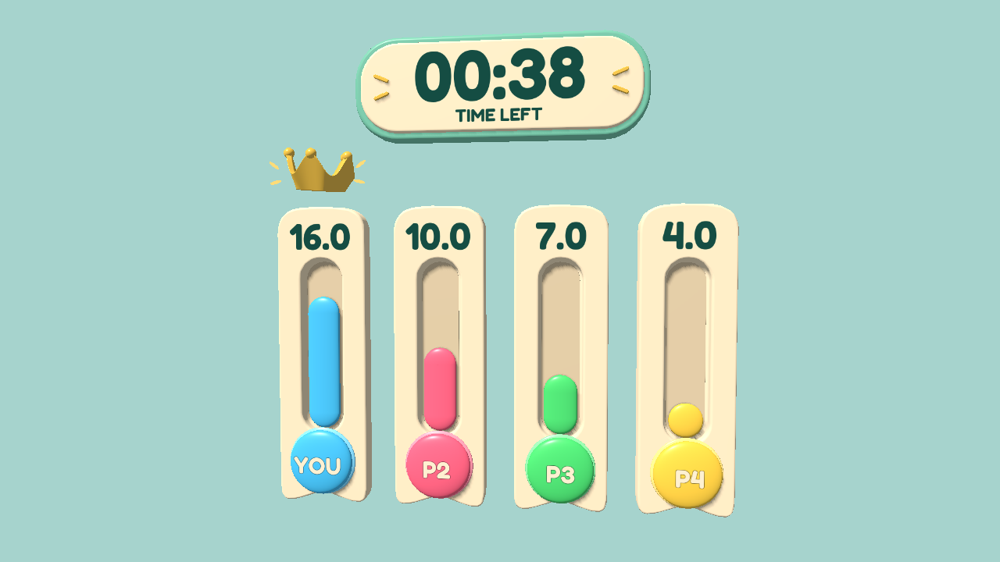
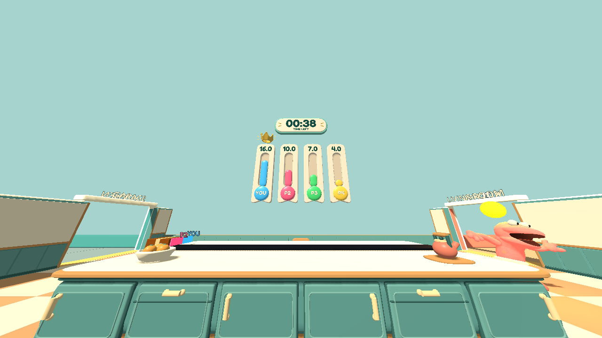
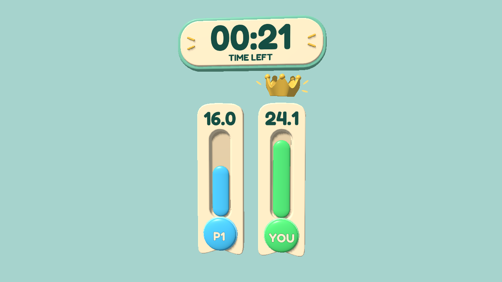
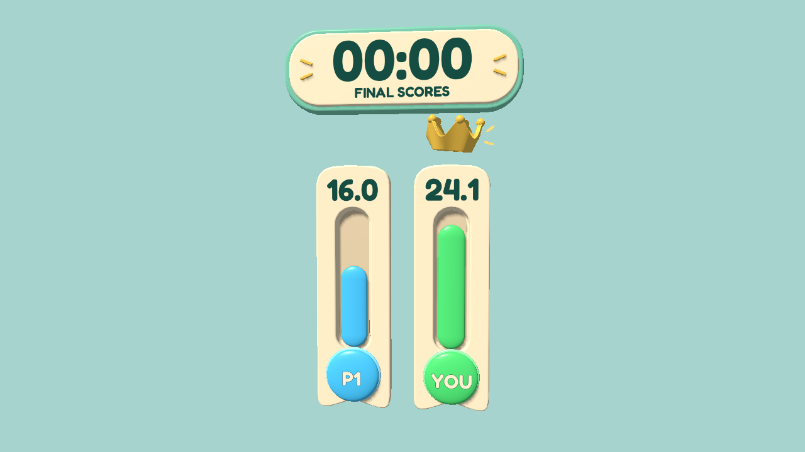

# Score Ribbons in Godot — v0.54

Approved direction: [B — Score Ribbons](../2026-09-21/b-score-ribbons.png).

These are native Godot viewport captures of the implementation in the game's existing lighting, not generated images or paint-overs. The scene is staged with known scores for inspection; the first-person-distance view uses the actual 100-degree game FOV. A separate two-process localhost fixture verifies live host/client updates.

## Four-player close view

## Player-distance view

## Two-player layout

## Round finished

## Verification

- Countdown formatting/rounding (75, 60, 59.4, 59, 0.2, 0 and negative time).
- Score values, fixed label positions, empty/tiny/maximum fill geometry and shared proportional scale.
- Two-, three- and four-player layouts, inactive slots, client-local YOU label, ties, changing leader, round finish, restart and lobby hiding.
- Real local ENet host/client score, timer, leader, final-result, restart and disconnect handling through existing protocol-16 packets.
- Post-match, multiplayer, round-transition, kitchen-art and Sockling-art regressions.

The sandbox cannot write the normal user diagnostic/cache folders; those expected environment warnings do not indicate a scoreboard failure. No live friend/WAN test or low-end GPU benchmark was performed for this cosmetic update.
