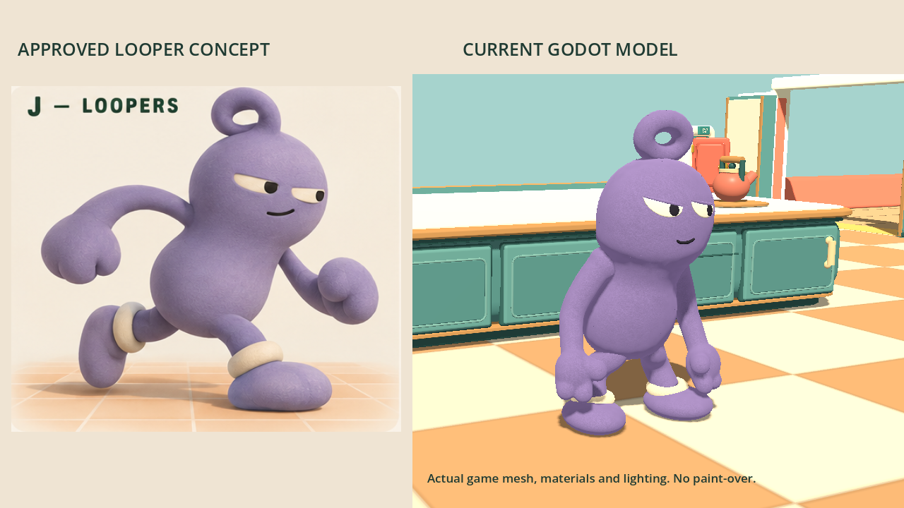
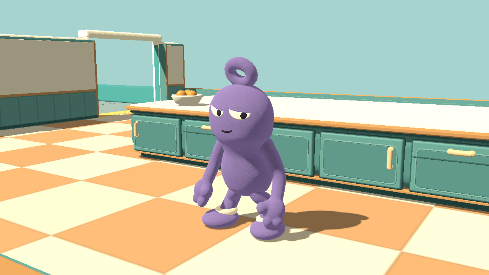
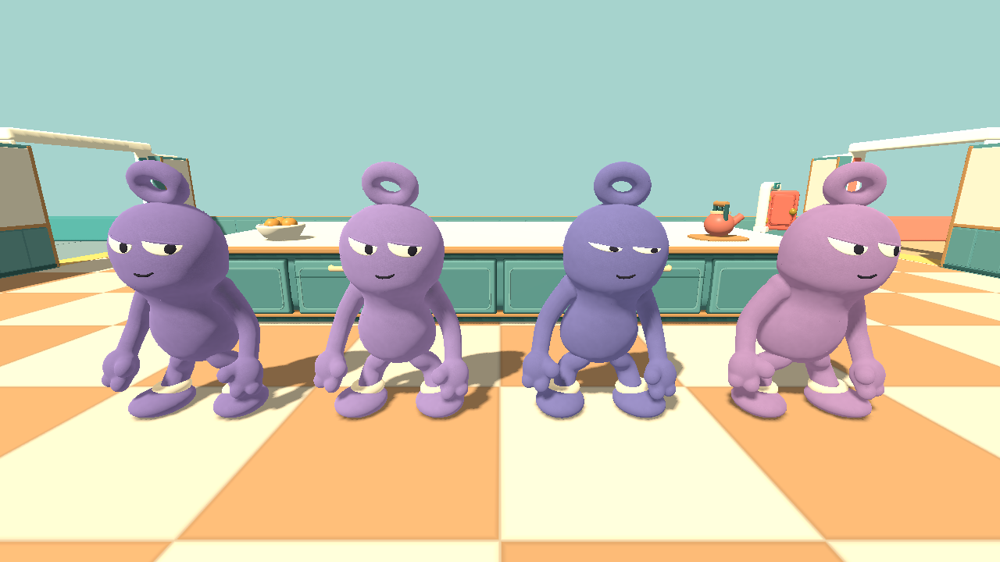
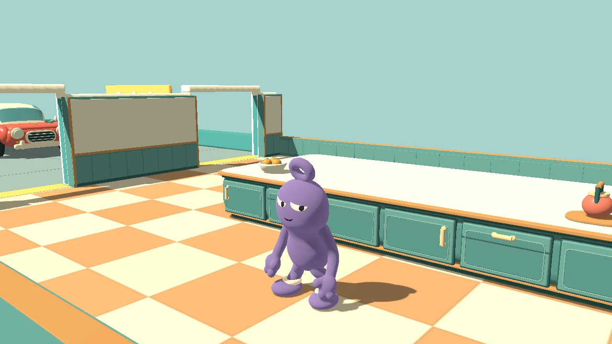

# Loopers — v0.58

Choose **Looper** under **Your character** in the lobby. Sockling is still available. The choice is cosmetic, remembered locally, and visible to other players. All peers need v0.58 / protocol 17.

The concept's defining features are a continuous soft pear-shaped body, broad rounded head, open fabric loop, sleepy sideways glance, tiny smirk, padded mittens, purple feet and ivory ankle cuffs. This model uses its own fine-pile velvet shader and tiny instanced silhouette fibres rather than the Sockling's curly terry texture. The first engine render revealed torso bands and hip gaps; the sculpt was rebuilt as one lofted body and the leg joins extended into it, then checked again in Godot.

These are actual engine captures under the kitchen lighting, not paint-overs or generated render substitutes. The approved concept uses softer studio lighting, so the in-game illumination is not identical. The comparison shows an idle pose beside the running concept. The nine-second staged animation shows idle, walk, run, jump/landing, carrying, crouch, slide and stun; locomotion runs in place. Other players, loose props and HUD are hidden for inspection.

## Reproduce and verify

- Geometry authoring: Blender background mode with `tools/build_looper_sculpt.py`; source `tools/sculpt-source/looper-sculpt.blend`; runtime `art/characters/looper/looper-sculpt.glb`.
- Poses: graphical Godot with `--path . --script res://tests/looper_art.gd -- --ati-test-instance --looper-preview`.
- Animation: the same test with `--looper-animation-preview`, followed by `tools/encode_looper_preview.py`. The encoder uses the 270 captured frames, with no interpolation or retouching.
- `looper_art.gd` checks the real mesh opening, face/ankle materials, all four palettes, geometry budget, arm skinning/leg morphs, movement, hiding, replica support and unchanged physics. `character_selection.gd` and `character_selection_network.gd` check valid choices, authority, match locking, mixed-skin decoys, preference restoration and reconnects.
- Final model: 77,538 base triangles. Repeated players, decoys and skin switches reuse immutable arm/fibre geometry without sharing their materials or animation poses.
- The exported v0.58 executable launched to `ATI_MENU_READY` and exited normally. The embedded game package also passed Looper, character-selection, decoy and menu tests using the Godot tools runtime. Source regressions passed for Sockling art/animation/arms, buddy rules, chaos items, multiplayer, hosting and round transitions.

Network checks use localhost; they do not establish public Internet/tunnel reliability. Low-end GPU performance has not been benchmarked.
