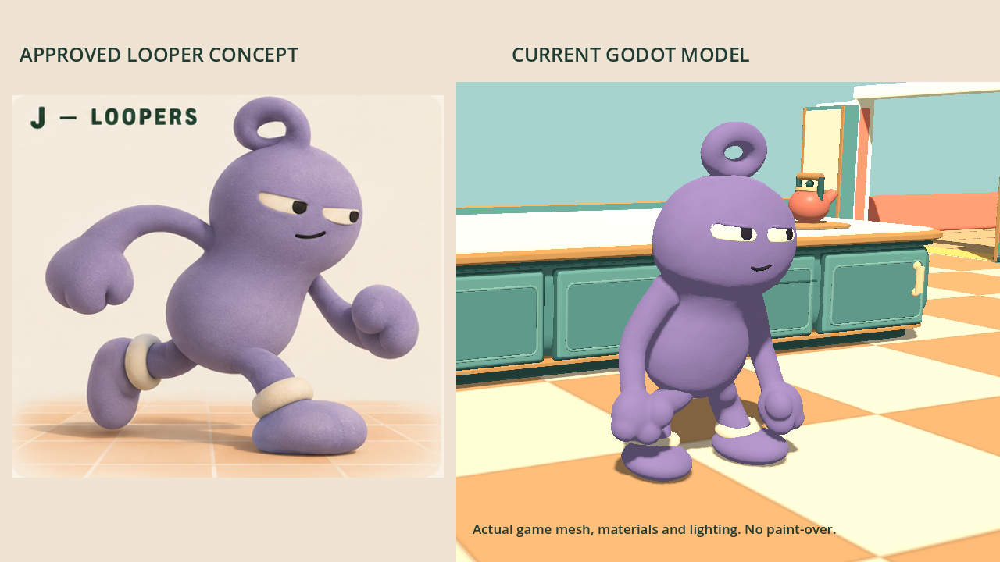
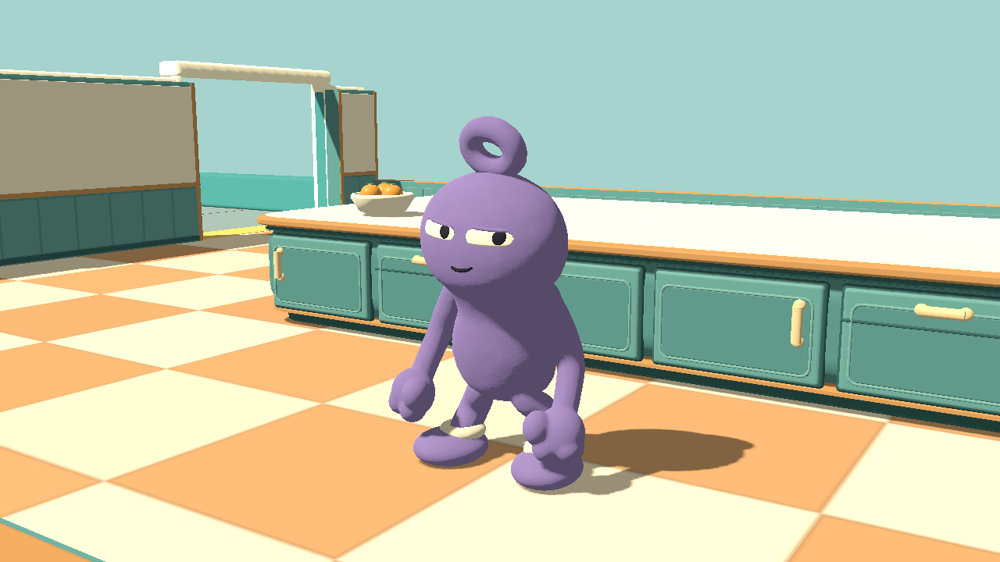
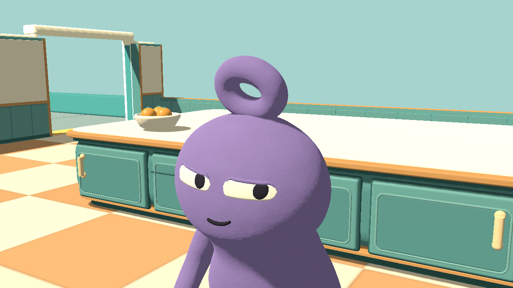
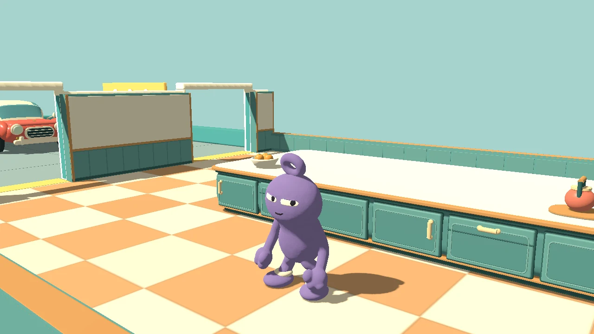

# Loopers — sculpted clay refinement, v0.59

Choose **Your character → Looper** in the lobby. This pass follows the request to move closer to the mockup with a clay texture, replacing v0.58's fuzzy velvet interpretation.

The surface uses matte clay shading, gentle hand-worked relief, faint pigment variation and broad restrained highlights. There are no fuzz fibres. The cream ankle rings also use clay; Sockling retains its original fleece. The head/cheeks are broader, the half-lidded eyes have softly rounded ends instead of angular corners, and the hands are fuller mittens with shallow fused lobes. The loop remains a real hole, not a decal.

These are unretouched engine captures under the existing kitchen lighting, not generated substitutes. The original concept uses softer studio lighting and a running pose; the side-by-side shows our idle pose. The nine-second in-place animation covers idle, walking, running, jumping/landing, carrying, crouching, sliding and stun. Other players, loose obstacles and HUD are hidden for the captures.

The change is cosmetic. Collider, movement, controls, score rules, selection, saved preference and Decoy Double identity remain unchanged. Build v0.59 retains protocol 17; use the same build on each PC for matching art.

## Reproduce

- Source sculpt: `tools/build_looper_sculpt.py` and `tools/sculpt-source/looper-sculpt.blend`.
- Runtime sculpt: `art/characters/looper/looper-sculpt.glb` (78,769 base triangles).
- Surface: `scripts/looper_clay.gdshader`; immutable mesh geometry is shared, while each actor/decoy keeps its own materials and pose.
- Native stills: graphical Godot `--path . --script res://tests/looper_art.gd -- --ati-test-instance --looper-preview`.
- Native animation: add `--looper-animation-preview`, then run `tools/encode_looper_preview.py` to encode the 270 actual captured frames without interpolation or paint-over.
- Tests: `looper_art.gd`, `character_selection.gd`, `character_selection_network.gd`, `decoy_skin.gd`, `sockling_animation.gd`. Checks include no fleece fibres, purple/cream clay materials, shared arm geometry with independent poses, real loop opening, animation/visibility, mixed-character decoys and reconnects.

All listed source tests passed, including both host/client processes. The exported Windows executable launched to `ATI_MENU_READY v0.59` and exited normally; Looper and character-selection tests also passed against its embedded game package using Godot's tools runtime. The older decoy test reported audio-playback resources at shutdown, but no leaked character resources or assertion failures.

Network checks use localhost, not a public Internet/tunnel session. Low-end GPU performance has not been benchmarked.
