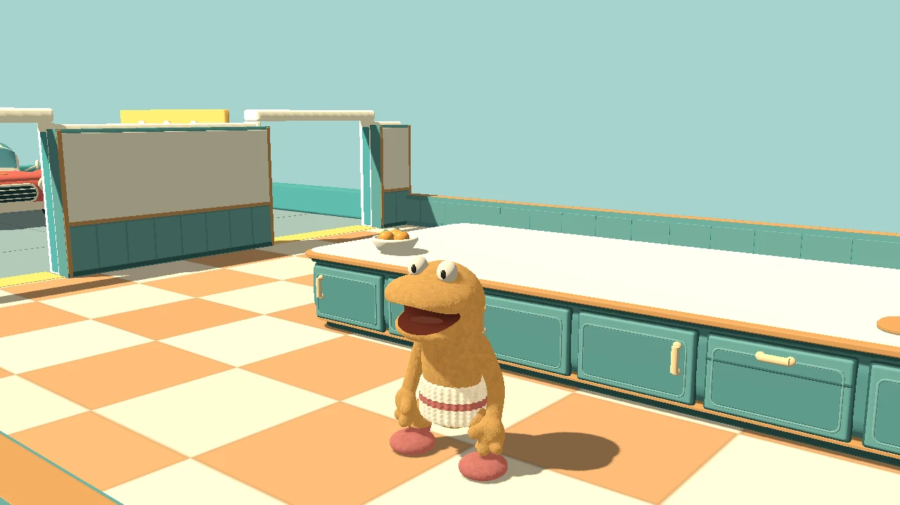
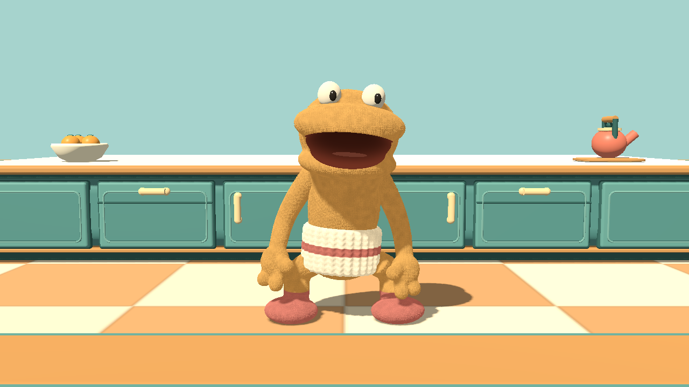
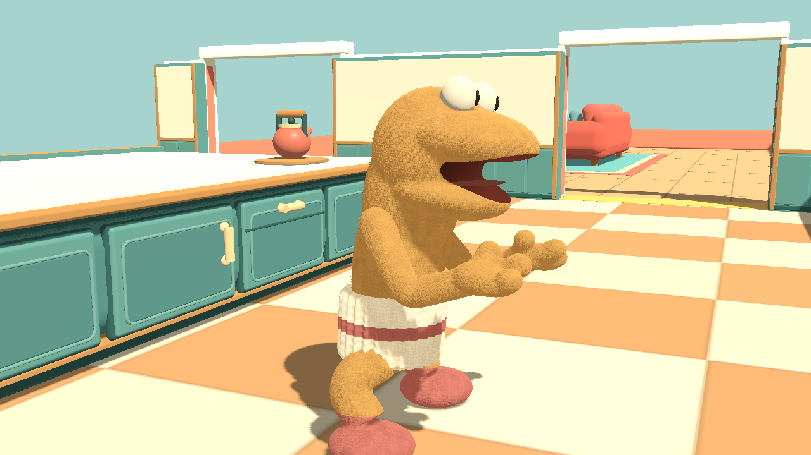

# Sockling arm and animation cleanup — v0.56

Relaxed hanging arms, inward-facing mitten thumbs, articulated elbows and softly trailing wrists. Shoulder swings oppose the legs; carrying bends forward around the prop. Less sideways slouch, chest bounce and landing squash keeps the existing puppet character without the old rigid, splayed pose.

The nine-second preview contains idle, walk, run, jump/landing, carrying, crouch, slide and stun. It is a staged inspection of the actual Godot model in the kitchen, not a live match recording. Locomotion runs in place; the jump uses a ballistic visual trajectory. Nearby loose props, HUD and scoreboards are hidden for inspection. No generated frames, paint-over or replacement studio lighting.

## Reproduce

Rebuild the sculpt with Blender's background mode and `tools/build_sockling_sculpt.py`, then import the Godot project. Run `tests/sockling_art_smoke.gd` with `--reference-preview` and `tests/sockling_animation.gd` with `--animation-preview` in graphical Godot. `tools/encode_sockling_preview.py` encodes the 270 native PNGs at 30 FPS. Capture outputs go to `build/network-test/`.

`tests/sockling_arm_rig.gd` checks every skin weight, inverse-bind identity, constant joint length, smooth opposing swings, wrist limits, stop/reset behavior and 30/60/144 FPS agreement. The existing art and animation suites check four colors, geometry limits, visibility, first-person hiding, crouch, carry, landing and unchanged physics. The two-process localhost animation fixture checks remote movement states plus articulated elbow/wrist motion through existing snapshots; this does not establish Internet/tunnel reliability or low-end hardware performance.
