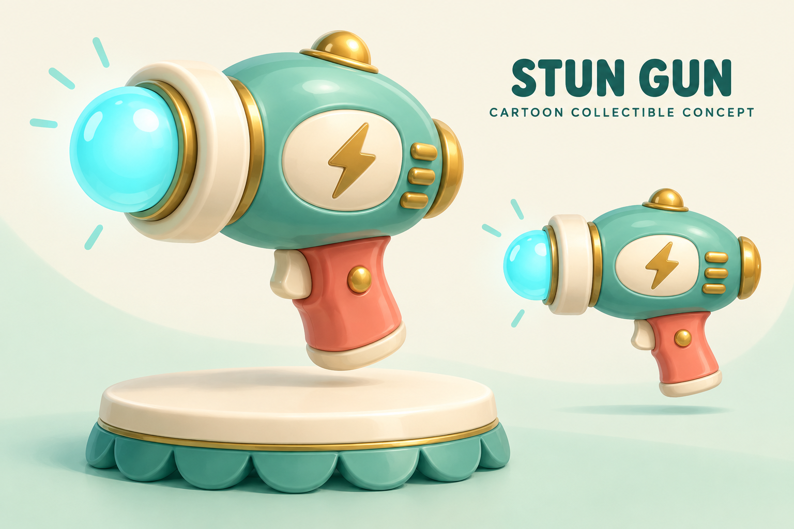
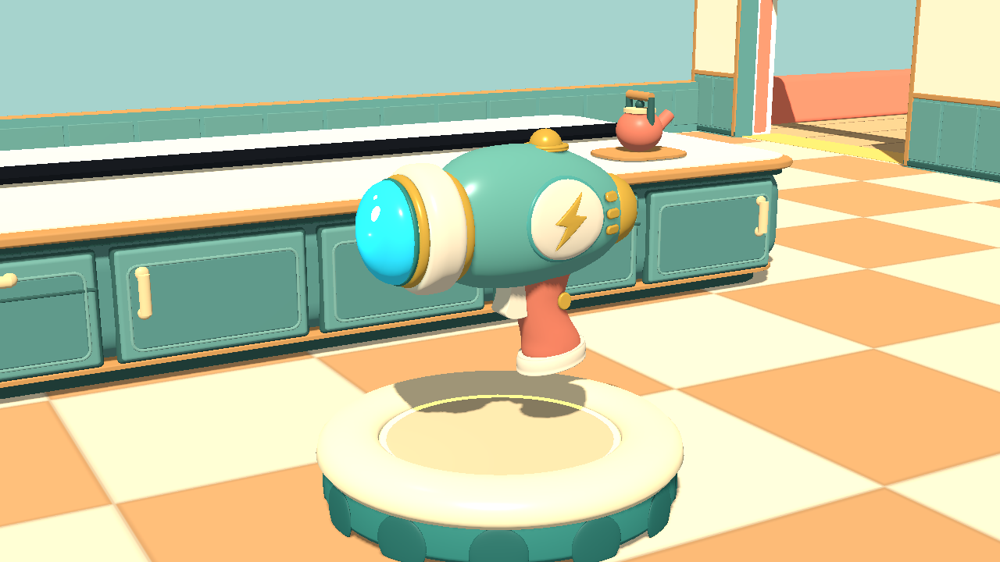
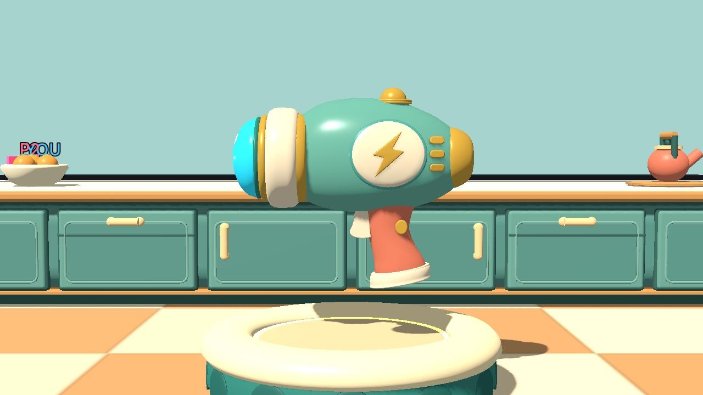
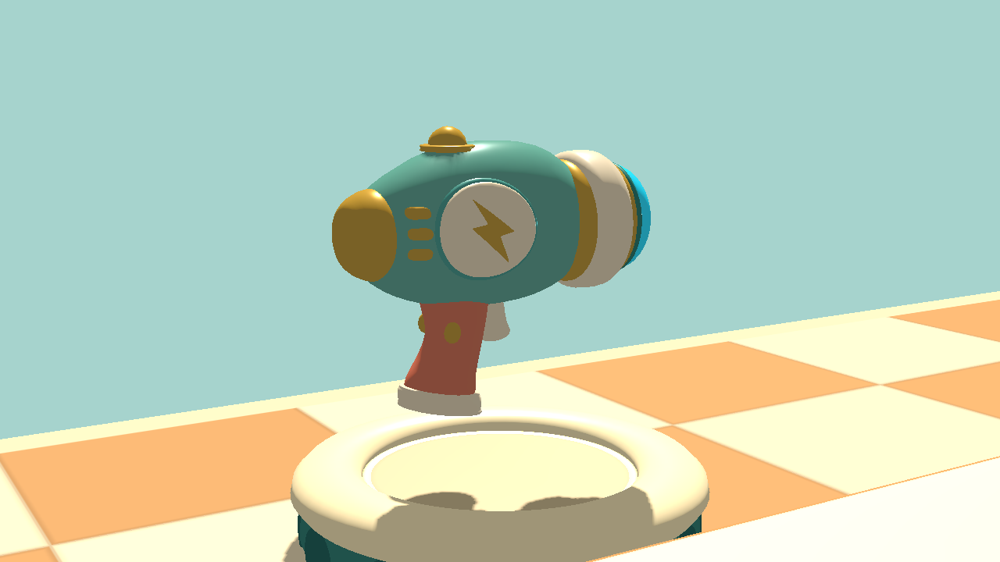
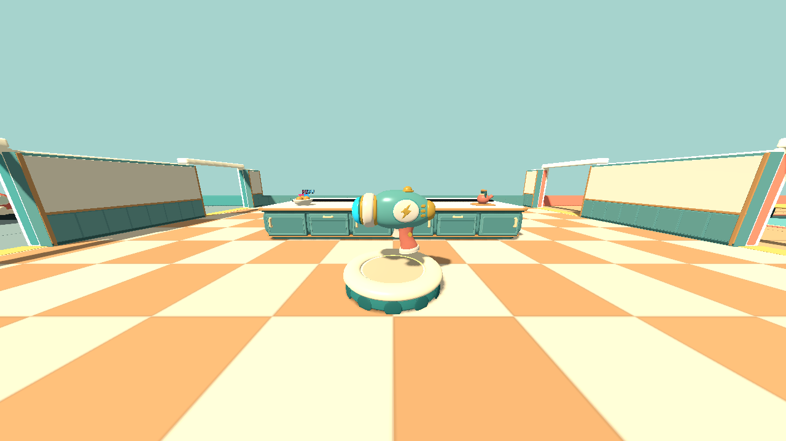

# Approved cartoon stun gun — v0.55

The user approved this concept on 2026-09-21 and requested a close in-game implementation. `approved-concept.png` is the image-generated design reference, not a gameplay capture.

## Actual Godot model

These are direct captures from the real kitchen scene with its existing lighting and renderer. Players, loose obstacles, the HUD and the distant scoreboards are hidden only for inspection. The pickup is created by the actual remote-spawn path; neither the model nor its lighting is painted over afterward.

The implementation keeps the concept's rounded shell, prominent cyan lens, thick cream collar, curved coral handle, cream foot, gold dome and lightning-badge details. Both sides are finished for a spinning collectible. Repeated native-render passes corrected shell breakthrough in the medallions, enlarged and rounded the lens, tuned the enamel colors, rounded the grip and fitted its foot.

The illustration's soft studio shadows differ from the game's directional lighting. The existing saucer is intentionally retained; the concept's decorative 2D charge rays are not static geometry on the model. This is a collectible-model refresh, not a new first-person held-weapon system.

## Reproduction and checks

- Blender source: `tools/build_stun_gun.py`.
- Runtime GLB: `art/pickups/stun-gun/stun-gun.glb` (48,748 source triangles, generated Godot LODs).
- Render/check: `godot --path . --script tests/stun_gun_art.gd -- --ati-test-instance`.
- Local multiplayer: run `tests/stun_gun_network_art.gd` in two instances with `--ati-test-instance --stun-host` and `--ati-test-instance --stun-client`. Uses localhost UDP 27996, not the public lobby.
- Checks passed for concept details, hover clearance, local collection, remote creation/removal/respawn, one-shot inventory, gun controls, other pickup models, modular-house passages, multiplayer state and Score Ribbons.
- Test sandbox cannot write normal user diagnostic files; console logs were inspected. Local checks do not establish remote Internet/tunnel reliability or low-end hardware performance.

## Reference provenance

Generated with the built-in image-generation tool in generate mode (`stylized-concept`), using the successful prompt below. No existing-image edit or in-game screenshot was used as the base.

> Create a stylized 3D concept illustration for the STUN GUN power-up in Around the Island, a whimsical cartoon video game. This is a completely fictional, nonfunctional toy-like game collectible, not a real weapon or engineering diagram. Show a friendly, stubby retro ray-gun silhouette made from exaggerated rounded toy shapes: mint-teal oval body, cream inset panel with a simple gold lightning icon, short coral handle, thick cream front collar and one oversized glowing cyan orb at the front. No real electrical mechanisms, no technical construction details, no realistic firearm parts. Rounded soft enamel and molded-plastic materials, honey-gold accents, broad glossy highlights. Strong simple silhouette that reads at small game scale. Saturday-morning-cartoon household-toy aesthetic. One large three-quarter hero view floating above a round cream collectible saucer with a teal scalloped base, with a smaller side view of the identical design on the right. Pale cream and mint studio backdrop, soft warm lighting, generous whitespace. Landscape polished game-art concept sheet, not a screenshot. Small dark-teal heading 'STUN GUN' and subtitle 'CARTOON COLLECTIBLE CONCEPT'. No characters, no hands, no combat scene, no logos, no watermark.
