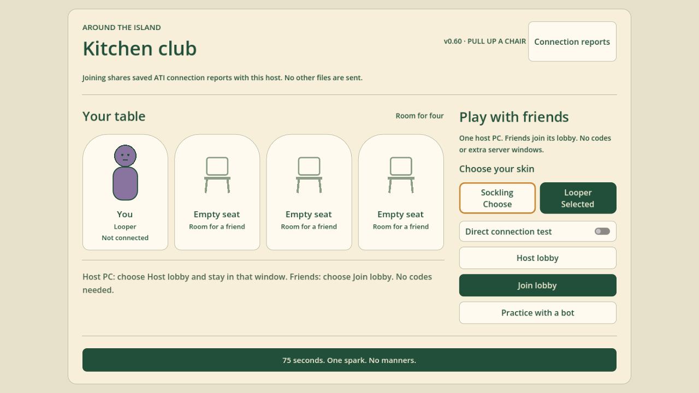
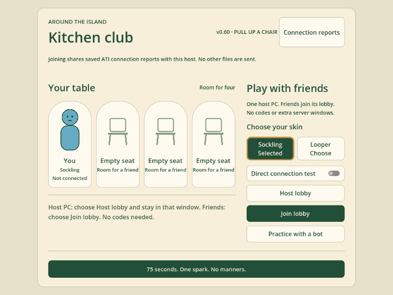

# Skin selection and practice bots — v0.60

Both choices are visible under **Choose your skin** on the main menu and in the waiting lobby. Click Sockling or Looper, or focus a button and activate it with Enter/Space or controller A. The selected skin is highlighted and remembered locally. Selection is locked while connecting or in a match.

The practice bot rolls independently from the available character catalog at every round start/restart. Repeats are allowed. Its skin remains stable during the round, including power-up use and respawns. Human players and inactive slots are excluded; online matches never reroll anyone's chosen skin. The cosmetic random stream does not affect spark selection or item spawns.

Regression coverage: `bot_skin_randomization.gd` compares seeded draws against an independent generator, covers both skins and their decoys, verifies restart/new-practice lifecycle and unchanged human choices. `kitchen_menu_smoke.gd` exercises button navigation and connection/match locks. `character_selection_network.gd` uses two real localhost ENet processes for chosen skins, lobby updates, mixed decoys and rejoining. Fixed-Sockling art tests now explicitly choose their subject instead of relying on the bot's former fixed default.

Source bot, character, menu, both character art/animation and gameplay regressions passed. Both processes passed the online character-selection fixture. Bot, character-selection and menu tests also passed against the exported game package using the Godot tools runtime. The Windows executable launched successfully to `ATI_MENU_READY v0.60`.

Protocol 17 is unchanged. Network verification is local, not a WAN/tunnel playtest. Controller menu input is tested with injected Godot joypad events, not a physical gamepad.
